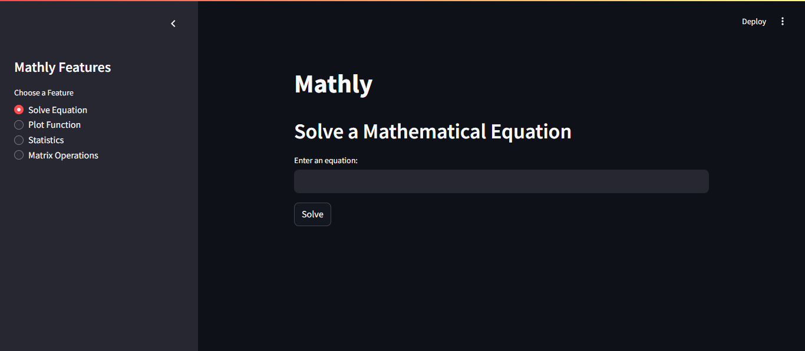
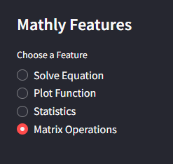
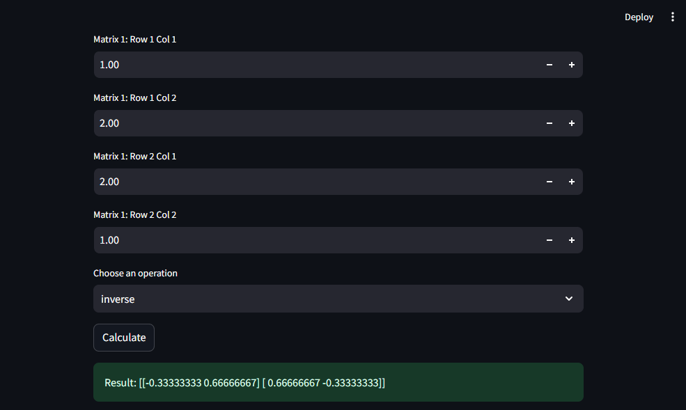
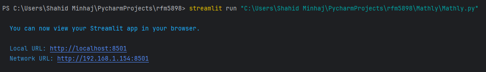

# 🧮 Mathly

See how Mathly helps you solve equations, visualize functions and perform advanced mathematical operations — all in a single interactive web app!  
Quantify, analyze and visualize mathematical expressions using modern Python libraries like **Streamlit**, **NumPy**, **SymPy**, and **Matplotlib**.

---

## ✨ About the Project

**Mathly** is a web-based tool that helps students, engineers, and analysts interactively solve equations, plot graphs and perform matrix and statistical operations.  
The application is powered by **Streamlit** and uses symbolic mathematics through **SymPy**.  
It provides an intuitive interface that simplifies complex computations with real-time visual feedback.

---

## ⚙️ Features

- 🧾 **Solve Equations** — Enter algebraic or trigonometric equations and get step-by-step solutions.  
- 📈 **Plot Functions** — Visualize mathematical functions on dynamic graphs.  
- 🔢 **Matrix Operations** — Perform addition, multiplication, inversion and determinant calculations.  
- 📊 **Statistics (Coming Soon)** — Compute mean, variance and other statistical measures.  

---

## 🧩 Preview

| Section | Screenshot |
|----------|-------------|
| **Home Screen** |  |
| **Feature Menu** |  |
| **Matrix Operations Example** |  |
| **Terminal Execution Example** |  |

---

## 🧠 How Mathly Works

1. User inputs an equation or selects an operation.  
2. The expression is parsed using **SymPy** for symbolic computation.  
3. **Matplotlib** and **NumPy** generate real-time visualizations.  
4. Results are displayed instantly through the **Streamlit web interface**.

This makes Mathly ideal for students, developers and data enthusiasts to test, visualize and understand mathematical concepts interactively.

---

## ⚡ How to Run the Code

If you do not have **git** installed, [download it here](https://git-scm.com/downloads).  
If you do not have **pip** installed, [download it here](https://pip.pypa.io/en/stable/installation/).

---

### 🧩 Step 1 — Clone the Repository

```bash
git clone https://github.com/rfm5898/Mathly.git
```

---

### 🧩 Step 2 — Navigate to the Project Folder

```bash
cd Mathly
```

---

### 🧩 Step 3 — Create and Activate a Virtual Environment

**Windows:**
```bash
python -m venv venv
venv\Scripts\activate
```

**Mac & Linux:**
```bash
python3 -m venv venv
source venv/bin/activate
```

---

### 🧩 Step 4 — Install Dependencies

```bash
pip install -r requirements.txt
```

If you face errors, try:
```bash
python -m pip install -r requirements.txt
```

---

### 🧩 Step 5 — Run the Application

```bash
streamlit run Mathly.py
```

Once it runs successfully, your terminal should look like this:  


---

## 📁 Folder Structure

```
Mathly/
│
├── Mathly.py
├── requirements.txt
├── Mathly_Home.png
├── Mathly_Features.png
├── Mathly_MatrixOperations.png
├── Mathly_Terminal.png
```

---

## 🧠 Technologies Used

- **Python 3.12**
- **Streamlit**
- **NumPy**
- **SymPy**
- **Matplotlib**

---

## 🧾 Notes

- Mathly runs fully offline and is lightweight.  
- Uses symbolic computation with **SymPy** and dynamic plotting with **Matplotlib**.  
- No API keys or external data required.  

---

## 👨‍💻 About the Developer

Developed by **Rayan Minhaj**  
🎓 Computer Science Major @ The Pennsylvania State University  
📫 Connect: [LinkedIn](https://www.linkedin.com/in/rayan-minhaj-%F0%9F%A4%96-a8492134b/) | [GitHub](https://github.com/rfm5898)

---
